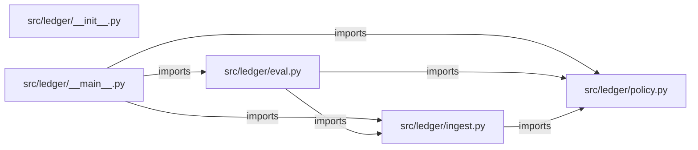

# fde-ledger-reconcile — project architecture

[README](README.md) · [Interview questions and answers](INTERVIEW_QA.md)

## Purpose and scope

Simulated forward deployed engagement for Brightpath, a payments ops team. Webhooks and the settlement file do not arrive once, and they do not always agree. The controller will not let software mark a payment settled when the cents differ.

This document describes files and symbols in this checkout. Deployment templates and statements in the original overview are distinguished from a verified running environment.

## Component diagram



For Python repositories, arrows show resolved local imports, not network calls or deployment order. Otherwise the diagram is a repository component map; containment arrows do not assert runtime integration.

## Components and responsibilities

| Component | Responsibility |
| --- | --- |
| [`src/ledger/policy.py`](src/ledger/policy.py) | Functions: `reconcile`, `render` |
| [`src/ledger/eval.py`](src/ledger/eval.py) | Functions: `run` |
| [`src/ledger/ingest.py`](src/ledger/ingest.py) | Functions: `load_events`, `load_settlements` |
| [`requirements.txt`](requirements.txt) | Implementation or supporting configuration |
| [`src/ledger/__init__.py`](src/ledger/__init__.py) | Implementation or supporting configuration |
| [`src/ledger/__main__.py`](src/ledger/__main__.py) | Functions: `main` |
| [`Dockerfile`](Dockerfile) | Container build/service configuration |
| [`tests/test_policy.py`](tests/test_policy.py) | Executable checks and regression examples |
| [`.github/workflows/ci.yml`](.github/workflows/ci.yml) | GitHub Actions job definitions |
| [`README.md`](README.md) | Project explanations or operating notes |
| [`docs/01-discovery.md`](docs/01-discovery.md) | Project explanations or operating notes |
| [`docs/02-security.md`](docs/02-security.md) | Project explanations or operating notes |

## Existing design and operating guides

These checked-in guides provide the project’s detailed design, operational context, or deployment view:

- [`docs/01-discovery.md`](docs/01-discovery.md).
- [`docs/02-security.md`](docs/02-security.md).

## Implementation walkthrough

### `reconcile(events: list[Event], settlements: list[Settlement])`

Source: [`src/ledger/policy.py`](src/ledger/policy.py#L42).

Match each webhook once. Never treat an amount mismatch as paid.

Calls visible in this function: `Outcome`, `Reconciliation`, `by_payment.get`, `matched_payments.add`, `outcomes.append`, `seen_events.add`, `set`, `tuple`.

```python
def reconcile(events: list[Event], settlements: list[Settlement]) -> Reconciliation:
    """Match each webhook once. Never treat an amount mismatch as paid."""
    by_payment = {item.payment_id: item for item in settlements}
    seen_events: set[str] = set()
    matched_payments: set[str] = set()
    outcomes: list[Outcome] = []
    matched_cents = 0
    for event in events:
        if event.event_id in seen_events:
            outcomes.append(Outcome(event.event_id, event.payment_id, "duplicate_event", "Ignored replay of the same event id."))
            continue
        seen_events.add(event.event_id)
        if event.payment_id in matched_payments:
            outcomes.append(Outcome(event.event_id, event.payment_id, "duplicate_payment", "This payment is already matched. Not counted again."))
            continue
        settlement = by_payment.get(event.payment_id)
        if settlement is None or settlement.status != "posted":
            outcomes.append(Outcome(event.event_id, event.payment_id, "pending_settlement", "No posted settlement. Left in the exception queue."))
            continue
        if settlement.amount_cents != event.amount_cents:
            outcomes.append(
                Outcome(
```

The excerpt is truncated; the linked source contains the full implementation.

### `run(path: Path | None=None)`

Source: [`src/ledger/eval.py`](src/ledger/eval.py#L12).

Calls visible in this function: `(path or EVALS_PATH).read_text`, `(path or EVALS_PATH).read_text().splitlines`, `by_event.get`, `by_event.setdefault`, `by_event.setdefault(outcome.event_id, []).append`, `cases.append`, `failures.append`, `json.loads`, `len`, `line.strip`, `load_events`, `load_settlements`.

```python
def run(path: Path | None = None) -> int:
    result = reconcile(load_events(), load_settlements())
    by_event = {}
    for outcome in result.outcomes:
        by_event.setdefault(outcome.event_id, []).append(outcome)
    failures = []
    cases = []
    for line in (path or EVALS_PATH).read_text().splitlines():
        if line.strip():
            cases.append(json.loads(line))
    if result.matched_cents != 1500:
        failures.append(f"matched_cents {result.matched_cents}")
    for case in cases:
        statuses = [item.status for item in by_event.get(case["event_id"], [])]
        if case["expected_status"] not in statuses:
            failures.append(f"{case['event_id']}: {statuses}")
    if failures:
        print(f"{len(failures)} eval failure(s)")
        for failure in failures:
            print(f"- {failure}")
        return 1
    print(f"{len(cases)} eval cases passed")
```

The excerpt is truncated; the linked source contains the full implementation.

### `load_events(path: Path | None=None)`

Source: [`src/ledger/ingest.py`](src/ledger/ingest.py#L14).

Calls visible in this function: `(path or DATA_DIR / 'webhooks.jsonl').read_text`, `(path or DATA_DIR / 'webhooks.jsonl').read_text().splitlines`, `Event`, `events.append`, `int`, `json.loads`, `line.strip`.

```python
def load_events(path: Path | None = None) -> list[Event]:
    events = []
    for line in (path or DATA_DIR / "webhooks.jsonl").read_text().splitlines():
        if not line.strip():
            continue
        row = json.loads(line)
        events.append(
            Event(
                event_id=row["event_id"],
                payment_id=row["payment_id"],
                amount_cents=int(row["amount_cents"]),
                currency=row["currency"],
            )
        )
    return events
```

### `load_settlements(path: Path | None=None)`

Source: [`src/ledger/ingest.py`](src/ledger/ingest.py#L31).

Calls visible in this function: `(path or DATA_DIR / 'settlements.csv').open`, `Settlement`, `csv.DictReader`, `int`.

```python
def load_settlements(path: Path | None = None) -> list[Settlement]:
    with (path or DATA_DIR / "settlements.csv").open(newline="") as handle:
        return [
            Settlement(
                settlement_id=row["settlement_id"],
                payment_id=row["payment_id"],
                amount_cents=int(row["amount_cents"]),
                status=row["status"],
            )
            for row in csv.DictReader(handle)
        ]
```

## Validation and failure paths

| Explicit exception | Source |
| --- | --- |
| `SystemExit(main())` | [`src/ledger/__main__.py`](src/ledger/__main__.py#L18) |

These are explicit exceptions in the inspected source, rather than a claim that every failure is handled. Follow the calling handler to see whether the exception becomes an HTTP response or propagates.

## Data flow and design decisions

### What is the input-to-output contract of `reconcile`

In [`src/ledger/policy.py`](src/ledger/policy.py#L42), `reconcile(events: list[Event], settlements: list[Settlement])` receives the inputs. The function computes these intermediate values:

- `by_payment = {item.payment_id: item for item in settlements}`
- `seen_events: set[str] = set()`
- `matched_payments: set[str] = set()`
- `outcomes: list[Outcome] = []`
- `matched_cents = 0`

Its result is defined by:

- `Reconciliation(outcomes=tuple(outcomes), matched_cents=matched_cents)`

### Which decision rules or boundary conditions should an interviewer challenge

The implementation in [`src/ledger/policy.py`](src/ledger/policy.py#L42) branches on:

- `event.event_id in seen_events`
- `event.payment_id in matched_payments`
- `settlement is None or settlement.status != 'posted'`
- `settlement.amount_cents != event.amount_cents`

A useful extension is a table-driven test that covers each condition just below, at, and above its boundary where applicable. These expressions are the current rules; changing them changes behavior and should be justified by the project’s acceptance criteria.

## Setup and verification

The following commands are derived from the checked-in dependency/test contracts. Execute them from the repository root; the block prepares a local environment, not a cloud deployment.

```bash
python3 -m venv .venv
source .venv/bin/activate
python -m pip install -r requirements.txt
python -m pytest -q
```

Python dependencies: [`requirements.txt`](requirements.txt).

Test entry points: [`tests/test_policy.py`](tests/test_policy.py).

Automation definitions: [`.github/workflows/ci.yml`](.github/workflows/ci.yml). Read their triggers and job steps to determine what CI actually runs.

## Operating boundaries and design review

Before turning this checkout into a customer deployment, establish the input contract, data ownership, access controls, failure response, evaluation criteria, and rollback owner. Repository fixtures and unit tests demonstrate local behavior; they do not establish throughput, uptime, compliance, or business impact.

A useful architecture review starts with the linked implementation: identify where input enters, where a decision is made, which state can change, and which external dependency can fail. Add a deployment view only for infrastructure that is actually configured and exercised.
